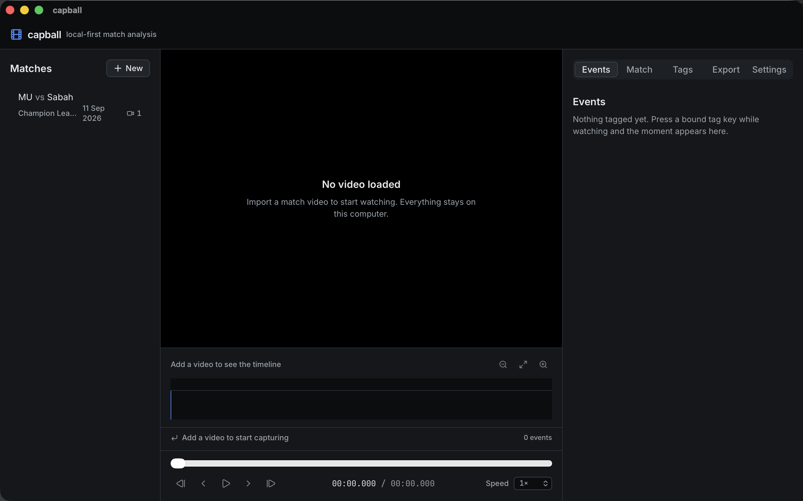

# capball

[](https://github.com/rogasper/capball/actions/workflows/ci.yml)

Local-first football match analysis. Import your own match video, tag moments with a single keystroke while you watch, and export clips around them.

Everything runs on your machine. No account, no upload, no backend.



## Status

**R1 is feature-complete and deliberately not released.** R0 made a working tagging tool — import a match, tag it, review it, export clips. R1 adds the analysis half: draw on the frame, mark where the pitch is, record where players were, see the shape on a top-down pitch, and burn the drawings into exported clips. It is used daily by its author; it has not been published, and the manual acceptance checklist has not yet been run end to end.

**R2 (Analyse & Report) has begun**, against the R1 gate rather than after it, on the author's decision: the first milestone is **reshaping a drawing corner by corner and patterned fills** (`plans/roadmap-R2.md`, M12). Everything already documented below is R1 and unchanged; the reshape and pattern entries below are the R2 work that has landed.

See [`plans/roadmap-R1.md`](plans/roadmap-R1.md) for the milestones and what each one proves *(kept locally; see [Documentation](#documentation))*.

## What works today

### Tagging (R0)

- **Import** one or more videos per match — halves, or several camera angles. Anything the OS player cannot open directly is prepared for you, losslessly where possible, with progress.
- **Playback** with full keyboard control: play, seek, frame step, speed, and a transport that keeps up with large 1080p files.
- **Your own taxonomy**: categories and nested tags, colours, and the keys you bind to them. A standard football vocabulary ships as an editable starting point.
- **One-key capture** while watching, with pre-roll and post-roll you set once. Events inherit the team and player you are currently focused on.
- **A timeline** you can zoom, pan, click to seek, drag to select a range from, and filter by tag, team or player.
- **Events** in chronological order, each jumpable, each with a note, each carrying the moment you actually tagged.
- **Review mode** that plays a filtered set back to back.
- **Clip export**, single or in bulk, fast or frame-accurate, optionally joined into one file, with file names templated from match, tag and time. Existing files are never overwritten.
- **Thumbnails**, **analysis export**, and **taxonomy export/import** so a vocabulary can be shared.

### Drawing and positions (R1)

- **Draw on a paused frame** — arrow, line, rectangle, ellipse, polygon, freehand stroke and text, with move, resize, rotate, restyle, layer order, and undo/redo. Each shape has its own time window: its moment, its event's range, or the whole clip.
- **Reshape a drawing corner by corner** — drag a corner to move it, click the small hollow grip on an edge to add one, and remove a corner with `Delete` or a double click. A rectangle that loses a corner becomes a zone with three sides, without redrawing it. The whole edit is one undo step.
- **Fill a zone with a pattern** — solid, hatch, cross-hatch, or outline only, with the line colour and the fill colour set independently. A patterned zone marks an area without hiding the players in it, and it is what tells two zones apart when colour is not an option. Patterns are drawn from the shape's geometry, so they stay sharp in an exported clip.
- **Calibrate the pitch once per video** by picking named landmarks (spots, area corners, the centre circle). The app draws the pitch those clicks imply over the frame, so a wrong pick is visible immediately, and it reports how closely the fit lines up and how much of the pitch your points actually cover.
- **Pick on a magnified frame** when the video is too small to click precisely — the frame at full resolution, zoomed, with the outline drawn on it. The same view is used for marking players.
- **Draw on the pitch, in metres** — open the Pitch tab on a calibrated video and draw a zone, line or arrow on the pitch diagram. The shape is stored in metres and projected into the camera's perspective, so it sits correctly over the video and follows the calibration if you correct it. Shapes drawn on the video frame stay on the frame and never move. Freehand and text stay frame-only, and the panel says so.
- **Give each team a colour** in the squads panel, and every marker, position and swatch follows it. Colour is never the only signal: a marker always shows the shirt number — or the player's initials when no number is recorded — plus the team's name.
- **Mark where players were** by clicking them on the frame. Positions are stored as pitch metres, survive a window resize, and appear on a top-down pitch with shirt numbers and team names. Markers show while the playhead is inside the event and hide when you scrub away, since a position only tells the truth at its own moment. Two moments can be compared, told apart by marker shape as well as colour.
- **Burn the drawings into exported clips**, each shape at its own time. Off by default, because carrying drawings means re-encoding the picture — the app says so, and the measured cost is about 14% over an accurate cut.
- **Analysis files carry the drawings, the calibration and the positions**, so a match can be handed to another machine whole. Importing the same file twice adds nothing.

## Limits

R1 is deliberate about what it does not claim:

- **No height.** A position is where a player stood on the pitch plane, never how high. One camera cannot recover height, so none is invented.
- **No automatic detection or tracking.** Every position is placed by hand. Nothing guesses who a player is or follows them between frames.
- **One moment per event.** Positions belong to a tagged moment, not to a range of frames.
- **A partial view is honest, not magic.** Where your reference points do not reach, a position is reported as a guess and the pitch outline is not drawn there. Calibrating from a single penalty area is usable inside that area and unreliable outside it.
- **A drawing needs a tagged moment.** Drawings belong to events; there are no loose annotations.

The manual acceptance checklist is in [`plans/qa-R1.md`](plans/qa-R1.md).

## Stack

| Layer | Choice |
| --- | --- |
| Desktop shell | Tauri 2 |
| Frontend | React + TypeScript + Vite |
| UI | Tailwind CSS + shadcn/ui |
| Client state | Zustand |
| Database | SQLite via `tauri-plugin-sql`, with Drizzle ORM (`sqlite-proxy` driver) |
| Media processing | FFmpeg, invoked as a subprocess |
| Package manager | bun |

## Requirements

- macOS 12.3 or later (Windows and Linux are planned)
- [bun](https://bun.sh)
- Rust toolchain (stable) and Xcode command line tools for the desktop build
- FFmpeg — detected at startup. If it is missing, importing and tagging still work; preparing files and exporting need it, and the app says so and points you at an install rather than failing later.

## Getting started

```bash
bun install

# Desktop app — the real development target
bun run tauri dev

# Frontend only, in a browser. Useful for UI work, but Tauri APIs are unavailable.
bun run dev
```

## Scripts

| Task | Command |
| --- | --- |
| Frontend dev server | `bun run dev` |
| Desktop app | `bun run tauri dev` |
| Production desktop build | `bun run tauri build` |
| Lint / format | `bun run lint` / `bun run format` |
| Typecheck | `bun run typecheck` |
| Unit and integration tests | `bun run test` |
| Rust tests | `cargo test --manifest-path src-tauri/Cargo.toml` |
| Generate a database migration | `bun run db:generate` |
| Generate test footage | `./scripts/make-demo-clip.sh` |

## Project structure

```text
src/features/   one slice per product area: library, player, timeline, tagging, events,
                review, annotate, pitch, export, settings
src/lib/        ipc (the only place that talks to Tauri), db (Drizzle), media, jobs, playback,
                time, settings, transfer, annotate (pure geometry), pitch (pure maths),
                render (the one canvas renderer)
src-tauri/      thin Rust shell: plugins, commands, subprocess jobs
tests/          unit tests, and integration tests that run the shipped SQL against real SQLite
```

## Documentation

Committed to this repository:

- [`DESIGN.md`](DESIGN.md) — design system, tokens, and UI rules
- [`AGENTS.md`](AGENTS.md) — instructions for coding agents, including the architecture rules

Kept locally and intentionally not published: the product requirements, technical design, roadmap, and architecture decision records. They are working documents that change faster than the code.

## Test media

This repository ships **no match footage**, and it never will. Generate synthetic clips for development and tests:

```bash
./scripts/make-demo-clip.sh
```

This writes an H.264/AAC MP4 (plays directly) and an equivalent Matroska file into `tmp/demo/`, which is gitignored.

## Contributing

Read [`CONTRIBUTING.md`](CONTRIBUTING.md) and [`AGENTS.md`](AGENTS.md) before opening a pull request. In short: run `bun run lint`, `bun run typecheck`, `bun run test`, and `cargo test --manifest-path src-tauri/Cargo.toml` before submitting, and use Conventional Commits.

## Licence

AGPL-3.0 — see [`LICENSE`](LICENSE).

You are responsible for the footage you analyse with this tool.
